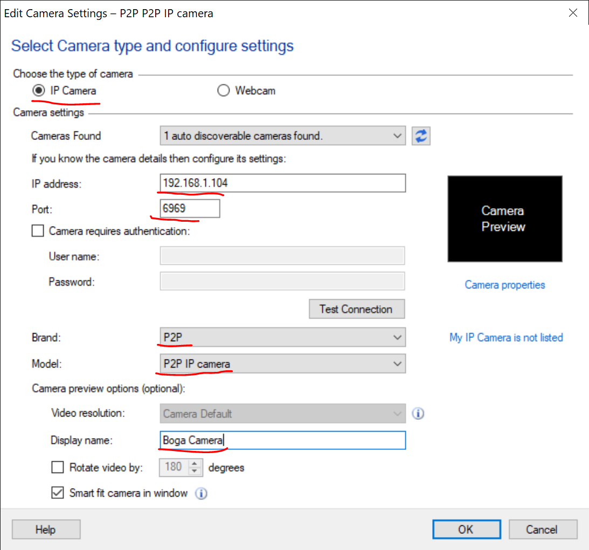

# BogaVision
An app designed to let you see whats going on when a scammer blocks your screen.

# Note: You must have [.net core 3.1 x86 runtime](https://dotnet.microsoft.com/download/dotnet-core/thank-you/runtime-desktop-3.1.9-windows-x86-installer) installed. Also you must be running windows 1903 or later.

# High-Level Overview
This app runs silently on your vm. It waits for an http connection on a port you specify (default is 6969).
When a connection is made with your browser (firefox/chrome) the app will start taking screenshots of the active window and then sends them to your browser as a mjpeg stream (security cams often use this protocol because its extremely simple)

Unfortunately we can't grab the entire desktop object because that is being blocked by teamview, zoho, anydesk...etc
However we can grab screen shots of individual windows!

This app is smart enough to detect the current window, so if the scammer jumps around you will be able to see it.

The exe name is msinfo64.exe so it blends in with other ms processes.

It doesn't do anything until you try to connect to the image stream. So it will not take up cpu cycles.

# ServerSettings.xml 
  I added a ServerSettings.xml file that lets you change the port, frame delay, and a list of windows you want to ignore.
  
  Delay is in miliseconds, so 30-50 is a good value. 
  
  Special feature: This app will not take screenshots of apps that you don't want (like teamviewer) so your connection codes are not exposed.  You just have to specify the window titles. 

# Notes:

The windows API that this app uses draws a yellow border around the window you are capturing (they did that for security reasons and can not be disabled) I don't think the scammer will notice/care.

You may have to install .net core 3.1 runtime on the vm (if it isn't there now)

Also, you have to install .net core 3.1 sdk if you want to compile this. (its in visual studio installer)

In theory you can set OBS to connect to your stream, but I found it lacks stability and just acts weird. Firefox works like a charm. Sometimes your connection will drop, you just have to hit f5 to restart.

The address for the stream is  http://YourVM:6969 or you can use ip http://1.3.3.7:6969

You might have to open up the port if your firewall blocks it.

# Viewing the Stream

After some experimenting, it looks like Firefox works the best. Other browsers can't handle when the image size changes. 

You can also install an IP Camera app https://www.techspot.com/downloads/downloadnow/6474/?evp=9bb9bdd470c21adc9f991cb79475c0a7&file=1

Enter the IP adress of the VM, the port, select P2P for the Brand and Model of the camera

